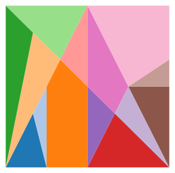
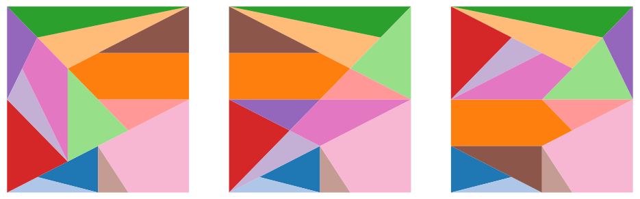

<section class="section-block">

# Ostomachion - the World's oldest puzzle
The Ostomachion is a puzzle as old as ancient Greece, having fascinated philosophers, mathematicians and the curious minds alike for millennia. It's an especially interesting puzzle to think about when you're bored in conferences (speaking from experience). The Ostomachion, attributed to Archimedes, is possibly the world’s oldest known puzzle. This ancient dissection puzzle challenges players to form a square from 14 distinct pieces — an elegant blend of mathematics and play. It looked like this:

<figure class="centered-figure">
  
  <figcaption><strong>Figure 1:</strong> The Ostomachion puzzle.</figcaption>
</figure>

This configuration of shapes is not the only way to produce a square. Moving these shapes around, we can find a few more solutions to the puzzle

<figure class="centered-figure">
  
  <figcaption><strong>Figure 2:</strong> Three additional solutions to the puzzle.</figcaption>
</figure>

One may ask: how many distinct ways can we rearrange the polygons to form a square? The answer wouldn't come until after two millennia with the advent of modern combinatorics and computing. The number is 17152. Or 536, if you don't count symmetries as distinct solutions.

In this series of posts, I will explain how I approached this problem from a computational perspective. This turned out to be a half-year endeavour, but a very rich and fruitful journey, and it all started when my girlfriend showed me a page on the book "Alex's Adventures in Numberland". It led me through the design of a special numerical system and subsequent approximations in the sake of computational efficiency. It led me through group theory, data structures, modern C++ and high-performance-oriented design. With these posts, I hope to share my enthusiasm for all the things I learned, and hopefully challenge someone to come up with a more efficient solution! 
</section> 

<section class="section-block">

## References:
- Wikipedia page: https://en.wikipedia.org/wiki/Ostomachion
- List of solutions: https://pi.math.cornell.edu/~mec/GeometricDissections/1.2%20Archimedes%20Stomachion.html
- Non-square solutions: http://www.logelium.de/Stomachion/StomachionPuzzel_EN.htm

</section> 

