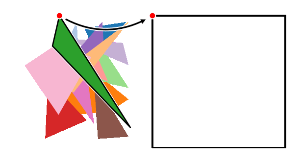
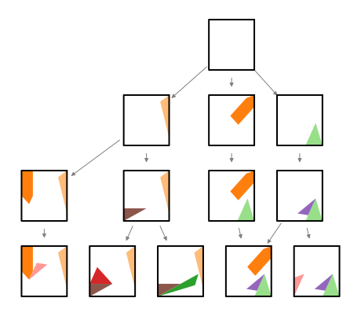
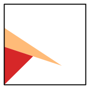

<section class="section-block">

# 2. Algorithm

Our ultimate goal is to find every single way to arrange the polygons inside the frame. To get there, we first need to understand how to sequentially add polygons in such a way that only valid solutions are obtained and that no valid solution is unreachable. In this section, we will come up with a set of rules that will help build an algorithm for this purpose.

</section>

<section class="section-block">

### Observation #1 - polygons can’t just be placed anywhere

Placing a polygon in some random location might easily give rise to an impossible state. For example, placing a triangle like this makes it impossible to add anything else in the bottom, making a solution with this triangle in place impossible.

<figure class="centered-figure">
  
  <figcaption><strong>Figure 1:</strong> Placing this triangle here produces a configuration where no solution can be found.</figcaption>
</figure>

To understand where we can actually place them, let’s look at the initial puzzle. We notice that in virtue of tiling the square, in a valid solution
- every polygon shares every edge with some other polygon or the frame
- no vertex is alone. Every vertex is shared with another polygon or the frame

This can be ensured by placing one polygon at a time, making sure it always shares a vertex and an edge with some other polygon or the frame. That’s our first rule

### Rule #1 - each newly placed polygon must share an edge and a vertex with some other polygon

So, each time that we want to add a new polygon, we choose one of the unused polygons from the polygon pool, select one of its vertices (call it a probing vertex) and move it into place by translating and rotating it until it lies on one of the edges. In the next step, we now have more vertices to choose from where it can be placed. It can either be placed in one of the vertices of the frame or the previously placed polygon. This step is repeated until no more polygons can be added. 

<figure class="centered-figure">
  
  <figcaption><strong>Figure 2:</strong> Building a solution to the puzzle by choosing a known sequence of vertices.</figcaption>
</figure>

It may happen that the specific choice of polygon positions is not valid: at some point we will reach a situation where anywhere we try to add a new polygon, it will overlap with some other polygon. To find all possible solutions to the Ostomachion, we just need to repeat the previous steps with every possible combination of polygons, and see which ones produce valid configurations. Concretely, we start with the empty frame, list out all ways to introduce one polygon to it satisfying rule #1, and then repeat this recursively for every new configuration produced. This generates a configuration space that needs to be traversed with some graph search algorithm. Here is an example of a (very) few branches of that graph:

<figure class="centered-figure">
  
  <figcaption><strong>Figure 3:</strong> A few branches of the Ostomachion configuration space.</figcaption>
</figure>

In reality, each of the nodes in the graph gives rise to a much larger number of children nodes (it's common to have more than 300 children), considering we have to take into account every single possible polygon that fits in every vertex and every possible way to put it there. This graph is an acyclic directed graph: there are several ways to get to the same configuration. Some branche produce impossible configurations very early on, some other branches will only reveal to be impossible at the very end, A very small fraction of the branches will give rise to proper solution, but in principle, this is enough to find us every possible solution to the Ostomachion puzzle. 

Or is it? 

</section>
<section class="section-block">

### Observation #2: this will take a while…

A quick estimate shows that this is an impossibly complex combinatorial problem. It’s simply not feasible to ask a computer to solve this. In the first iteration, there’s 4 vertices to choose from, 14 polygons (11 with 3 vertices, 2 with 4 vertices and one with 5), which can be flipped for a total of 368 possibilities. The actual number will be slightly smaller because some of these will be outside of the frame and are not valid configurations. In the second iteration, the number of vertices to choose from has become larger. It can range from 5 to 7. To get a quick estimate out of this, let’s assume that every polygon has 3 vertices and there’s always 4 vertices to choose from. Then, the number of configurations that need to be analyzed is `(3*4*2)^14*14!` which is around `2*10^30`. This estimate falls short of the actual number because there’s polygons with more vertices and after a few polygons have been placed, the number of vertices to choose from is much larger than 4. But we also need to keep in mind that a large portion of these configurations will be noticeably impossible from an early stage, so that branch doesn’t need to be explored, meaning that the estimate might actually be too large. Regardless, this is an astronomically large number.

We need to narrow down the search space. With the current approach, to make sure that every solution is reached, we could try out every possible probing vertex of every available polygon on every anchor vertex.  In reality, however, if we focus on just one of the vertices, any possible solution that contains this current configuration of polygons will have to have that vertex completely filled, so we just need to consider **one** vertex and **all** the combinations of polygons that fit in there. But we can still do better. Given that all combinations of polygons that fit in this vertex will have some polygon on the right edge, **we just need to try out all polygons that fit on the vertex and lie on that edge**, and then delegate the remaining search to the next recursive step. This massively reduces the search space by getting rid of the `4^14` and brings down the number of configurations to `7*10^21` . If every person on Earth had a computer that could check one configuration every microsecond, we would be done in 10 days. Not too bad. Fortunately, there are plenty of optimizations we can do to get this to run much faster, which will be discussed later.

One question remains: can we choose just any anchor vertex for this purpose? Unfortunately, <b>no</b>. And the reason for this is as subtle as the letter “b” in “subtle”. Suppose our criterion to choose an anchor vertex is to always choose the widest angle. Then, the achor for the configuration on the left below is the inner-most vertex of the red triangle. Placing the next triangle in that anchor, we have now made it impossible to find solutions which might have the orange triangle in the following specific position:

<figure class="centered-figure">
  

    

      
      
1. Starting configuration

    

    

      
      
2. Triangle inserted at widest angle

    

    

      
      
3. Yellow triangle will never be considered 

    

  

  <figcaption><strong>Figure 4: </strong>Inserting polygons at the widest angles creates impossible configurations.</figcaption>
</figure>

This only happens because one of the edges of the orange triangle intersects a vertex of the red triangle. By requiring all anchors' angles to be smaller than 180º, we will never end up in this situation because the anchor would never be a potential intersection for some other edge.

### Rule #2 To obtain all possible solutions containing the current configuration, we only need to consider one vertex, so long as its internal angle is <180º

The only thing left to decide is: which vertex do we choose? For the purpose of solving the problem, it doesn’t matter, but this choice will have important consequences when we decide on the data structures we want to use to traverse the search space. 

</section>
<section class="section-block">

## Summary 
To recap, this is the algorithm we will follow. Given some configuration,

- Choose any vertex whose internal angle is <180 and set it as the anchor point and its right edge as the anchor edge.
- Select a polygon from the list of polygons which have not been used yet, and choose a probing vertex from that polygon. Also choose whether to flip the polygon or not.
- If the probing vertex fits in the anchor vertex, bring the polygon here and rotate it to lie on the anchor edge. Make sure it doesn’t intersect anything. This is now a new valid configuration.
- Do the same for all the vertices of this polygon, and then for all the polygons in the list of remaining polygons.
- This will give rise to a new set of valid configurations. Repeat the whole process for each of these configurations.

Starting from a configuration with only a frame and no polygons, this algorithm will produce only valid configurations while not missing out on any valid solution. In the next sections, we will see how to represent this algorithm geometrically, and we will find out how a special set of numbers fits perfectly in this use case - the algebraic numbers.

</section>