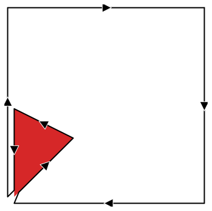
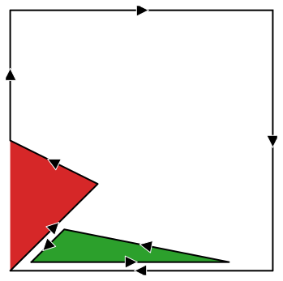
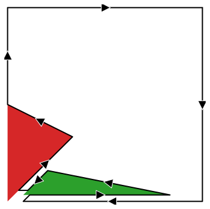
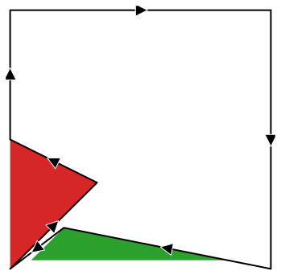
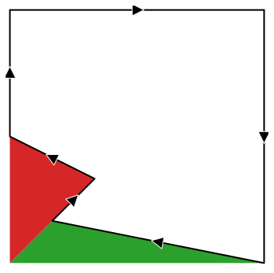

<section class="section-block">

# 3. Geometric representation

In the previous post, we figured out the algorithm to solve the Ostomachion puzzle. Looking ahead, we will need to figure out a way to efficiently store puzzle configurations in memory, how to quickly check if a configuration is valid or not and minimize memory transfer operations along the whole way.

A valid configuration consists of a frame and a set of polygons sharing edges and vertices. To produce the next valid configuration from this one we need to:

1. select an anchor vertex from the frame in this configuration
2. place an unused polygon on that anchor vertex. 
3. check if the new polygon overlaps any other polygons and is still inside the frame
4. if that was successful, then create a new configuration with this polygon added and an updated frame

Most of the computational effort will likely lie in the overlap checks while most of the memory operations will probably lie in the creation of a new configuration. With this in mind, these are a few solutions that could be used:

</section>
<section class="section-block">

## Solution 1: keep a list of used polygons and their positions

This is the simplest approach. We just keep track of the positions of every polygon already placed, and each time that we want to add a new polygon, we just need to check if it overlaps any of the existing ones. If all the polygons involved are convex, we can use an efficient [separating-axis algorithm](https://web.archive.org/web/20141127210836/http://content.gpwiki.org/index.php/Polygon_Collision) to check for overlap. If they’re not, we can divide each non-convex polygon into a disjoint set of convex polygons, such that each check is simpler. If there are a lot of non-convex polygons, this quickly becomes another combinatorial nightmare. 

Alternatively, it’s possible to check if two polygons overlap by introducing additional checks. To be completely thorough, a lot of checks need to be done (and we’ll discuss these at length later in this), but realistically, most of the times that two polygons overlap, some edges will intersect. There are edge cases where this is not enough, and that’s why we require additional verifications, but these happen seldom enough that this general approach is still efficient enough.

The downsides of this solution is that the more polygons exist in the configuration, the more checks need to be made, so the algorithm becomes slower precisely in sections of the search tree where there’s a lot of configurations. It also requires storing the locations of every vertex - adding memory transfer overhead when creating new configurations. It also has redundancy, because the same edge may be part of two different polygon, and it will be checked twice.

</section>
<section class="section-block">

## Solution 2: same as above, but add bounding boxes

Taking inspiration from game design, adding a bounding box to each polygon reduces the amount of overlaps to check. A check for polygon overlap won’t even happen if the bounding boxes don’t overlap - and it’s very easy to check this. Additionally, organizing the polygons in a quad-tree can even reduce the amount of bounding box overlap checks. But each of these additional layers of optimization require additional data to be stored/transferred and more complicated logic and indirection. I highly doubt this is optimal when the objects we want to check are mostly triangles and when AVX vectorization can make checking intersections blazingly fast. I classify this solution as overengineering.

</section>
<section class="section-block">

## Solution 3: merge and prune

A more elegant approach consists of representing the polygons as if they were patches of fabric which get sown together along their edges. The only thing that matters is the outer edge of the sown-together polygon, which can now be interpreted as the frame for the next iteration. 

<figure>
  

    

      
      
1. Starting frame.

    

    

      
      
2. After adding the first polygon.

    

    

      
      
3. After the second. 

    

  

  <figcaption><strong>Figure 1: </strong>Adding new polygons to the existing frame is equivalent to updating the frame to be the new contour.</figcaption>
</figure>

This polygon is in general a non-convex polygon but this choice minimizes redundancies: each time that a new polygon is added, it only needs to be checked for overlap with the frame, nothing else. Moreover, considering that most of the times only an edge intersection algorithm needs to be executed to determine overlap, that makes this a good candidate for the most efficient solution. Furthermore, it reduces redundancy because no duplicate edges or vertices can exist. I call this the merge and prune algorithm because it consists of two steps: 

1. Bring the polygons together and connect them through their common vertices such that they become one single (possibly complicated) polygon
2. Remove overlapping edges to minimize redundancy

Computer Science majors might recognize the first part as the algorithm to merge two linked lists. 

At this point you might ask: "In order to produce the final solution, aren't you going to need to keep track of the positions of all the polygons added so far? Doesn't that defeat the purpose of using the merge and prune algorithm?". While it is true that we need to know where the polygons will be located to produce a pretty figure, we only need to do it at the end - so long as keep track of the order in which the polygons were introduced and what vertex-selection algorithm was used!

Merging and pruning minimizes redundancy and has a small memory footprint, but most importantly, it seemed like a fun thing to implement. So this was my method of choice. This is how it works:

</section>
<section class="section-block">

## Merge

Since we want to merge shapes together, assigning an orientation will make the process easier and turns the polygons into **linked lists**. Let’s consider the frame to have its edges oriented in a clockwise fashion and all the polygons that we want to insert to be oriented anti-clockwise. This choice has many advantages - as will become evident along this post - but most importantly, it will allow us to interpret the final shape as a clockwise-oriented frame after the algorithm is done. Further, let’s define the “outside” portion of a polygon to always lie to the right of its oriented edge. So in the case of the frame, this definition of outside corresponds to the region where we want to place the puzzle polygons. This allows us to claim that a polygon can be added only if it does not overlap with the frame, i.e. their inside regions do not overlap. 

The merge step consists of joining the two polygons together through their anchor and probe vertices. The edge coming into the anchor vertex will disconnect from it and connect to the probe vertex. Similarly, the edge coming into the probe vertex will connect to the anchor vertex. The following figure is a visual representation of the process.

<figure>
  

    

      
      
1. Starting configuration

    

    

      
      
2. Add a polygon

    

    

      
      
3. Merge the linked lists 

    

  

  <figcaption><strong>Figure 2: </strong>Inserting polygons inside the frame requires merging the two linked lists.</figcaption>
</figure>

</section>

<section class="section-block">

## Prune

After merging, some of the edges will be overlapping, representing paths going back and forth which can be simplified. Some adjacent vertices might also be overlapping, in which case one of them gets removed. This process is repeated until the frame cannot be simplified further. At its limit, it will simplify down to the empty set when a solution has been found.

<figure>
  

    

      
      
1. Starting configuration

    

    

      
      
2. Merge

    

    

      
      
3. Prune the bottom 

    

    

      
      
4. Prune the left 

    

  

  <figcaption><strong>Figure 3: </strong>Merge and prune algorithm.</figcaption>
</figure>

Here is an example of the whole algorithm in action:

<figure class="centered-figure">
    
  <figcaption><strong>Figure 4: </strong>Merge and prune algorithm applied to a full solution of the puzzle.</figcaption>
</figure>

The resulting frame polygon is in general non-convex, so we need to come up with an algorithm that is able to detect when two general polygons overlap. This is the subject of the next section.

</section>