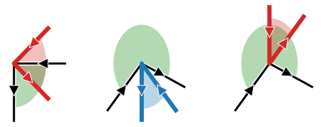

<section class="section-block">

# 4. Polygon overlap

When is the polygon entirely inside the frame? This verification is at the core of solving the Ostomachion puzzle. We need a reliable way to determine when a configuration of polygons is valid, which requires knowing when a polygon candidate will be entirely contained inside the frame.

</section>
<section class="section-block">

## Edge-edge intersection and determining if it's inside

The most obvious sign that the polygon is not inside the frame is when any of its edges intersects with those of the frame. That means that some portion of the polygon is inside and another is outside the frame, so it cannot be entirely contained in the frame. 

If no intersection occurs, we still need to check whether it lies in the frame's outer region or not. This is easily done with a ray tracing algorithm.

The following figure shows three examples. The blue polygon lies entirely in the frame's outside region, while the smallest red polygon is in the inside, meaning it overlaps with the frame. The large red triangle's edges intersect the frame.

<figure class="centered-figure small">
  
  <figcaption><strong>Figure 1: </strong>Two polygons overlap if their edges intersect or if one vertex is inside the other polygon.</figcaption>
</figure>

These two situations cover most of the common polygon overlaps, that is, the ones that don’t involve any coincidences. When vertices coincide with other vertices or edges, things start getting interesting. Let’s analyze some cases where neither of the previous approaches could detect overlap.

</section>
<section class="section-block">

## Edge-vertex coincidence

The figure on the left shows cases where polygon edges intersect with frame vertices and polygon vertices intersect frame edges. The figure on the right shows cases where polygon vertices intersect with frame edges but those create a coincident edge.

<figure>
  

      

      
      
1. Edges intersect vertices

    

    

      
      
2. Edges coincide

    

  

  <figcaption><strong>Figure 2: </strong>First type of cases where a simple edge intersection algorithm would not work: when edges intersect vertices</figcaption>
</figure>

Grabbing the frame and stretching it out into a straight line, what’s actually going on becomes clearer after drawing out all the arrows and focusing only on the vertices. The polygon and frame overlap whenever any vertex opens outwards or crosses the frame. If every vertex opens inwards, then the polygon and frame don’t overlap.

<figure class="centered-figure">
    
  <figcaption><strong>Figure 3: </strong>Zoom in of edge-vertex intersection.</figcaption>
</figure>

Keeping in mind that the frame can also intersect the puzzle polygons’ edges, this verification needs to be done for both the candidate polygon and the frame.

</section>
<section class="section-block">

## Vertex-vertex coincidence

The last remaining case happens even less frequently: when vertices coincide. The next figure shows several examples that would not be captured by any of the previous approaches

<figure class="centered-figure small">
    
  <figcaption><strong>Figure 4: </strong>Second type of cases where the simple edge intersection doesn't work: exclusive vertex-vertex intersection.</figcaption>
</figure>

To determine whether overlap occurs, it is sufficient to analyse each vertex individually and zoom into it such that the only visible edges are the frame and polygon edges coming in and out of that vertex. Then, consider the angle swept by the incoming and outgoing edge. If the angle swept by the polygon overlaps the angle swept by the frame, the two polygons overlap. This is shown in the figure below. As before, red means an invalid configuration and blue a valid one:

<figure class="centered-figure">
    
  <figcaption><strong>Figure 5: </strong>Angles swept by the polygon and frame at the vertex.</figcaption>
</figure>

This check was made possible thanks to the directionality assigned to the frame and the polygons.

## Summary
This is all we need from a geometrical standpoint, and it will enable us to check for overlap between any two arbitrarily complex polygons. Next, we will see how to represent these polygons mathematically.

</section>